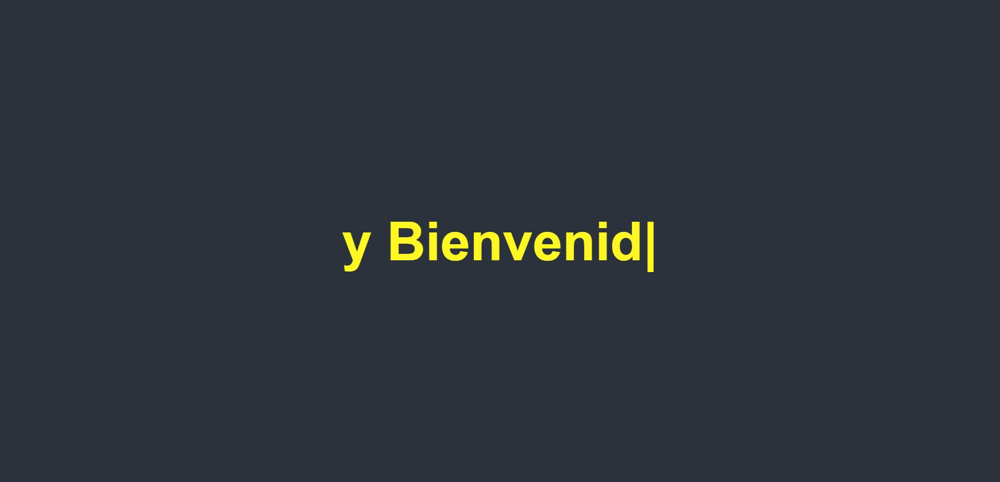
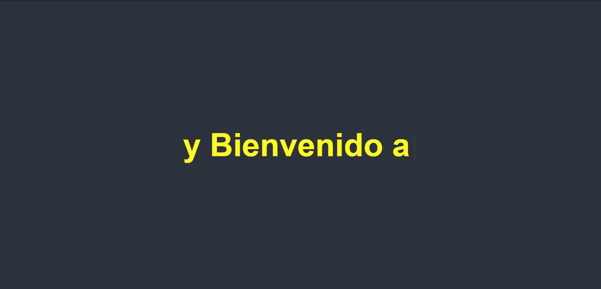
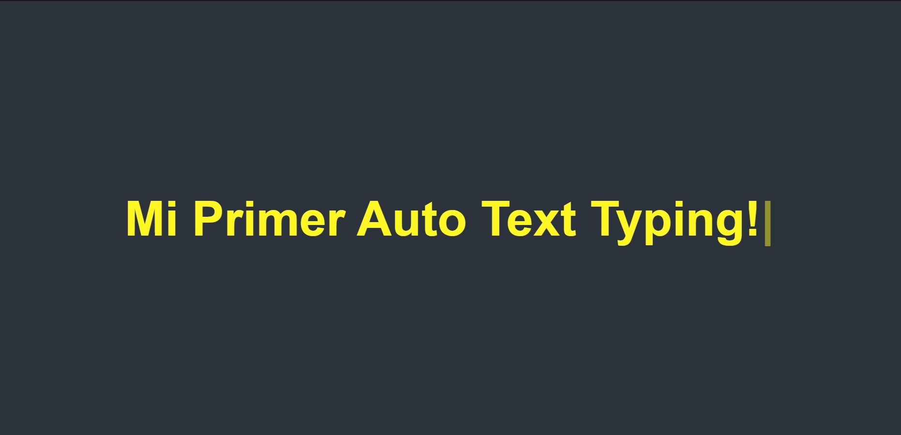

# Animación-de-Text-Typing
un texto animado que da la sensación de que se escribe solo cuando lo observas, dando una señalación de Interactividad. hecho en HTML, CSS y JavaScript.  

<div align="center">
  <a href="https://carlosorellana00.github.io/Animaci-n-de-Text-Typing/" rel="noopener">
    
  </a>
    
  [](https://html.com/)
  [](https://www.w3.org/Style/CSS/Overview.en.html)  
  [](https://www.javascript.com/)
  [](https://github.com/mattboldt/typed.js/)
</div>


## ¿Cuál es el fin de este proyecto?
Es una simple pagina hecha en HTML, CSS y JavaScript. 
Su objetivo no es mas que el aprendisaje y practica de herramientas que nos puede proporcionar JavaScript, en este caso "typed.js". una herramienta que nos permite dar
el efecto de escritura que cambia reescribiendose de forma automatica.

## ¿Cómo se implemento type.js en este proyecto?
se implemento a traves de CDN, mediante el siguiente comando.

```html
<script src="https://cdn.jsdelivr.net/npm/typed.js@2.0.12"></script>
```

## ¿Puedo Probar este Proyecto en Linea? 
Si, Puedes probarlo en linea haciendo click [aqui](https://carlosorellana00.github.io/Animaci-n-de-Text-Typing/)

## ¿Cómo puedo probarlo de manera local en mi equipo?
puede copiarse directamente desde git a traves de comando o descargarse en un archivo Zip, el proyecto no requiere de ningun servicio de servidor para correrse
de manera local en una computadora.

## ¿Cómo se nos presenta?

al abrir la pagína veremos como esta posee un texto en su area central, dicho texto veremos como se esta escribiendo, siendo la palabra "Hola"
<div align="center">
  <a href="https://carlosorellana00.github.io/Animaci-n-de-Text-Typing/" rel="noopener">
    
  </a>
</div>

posteriormente veremos como esta misma palabra empieza a borrarse, de una forma similar a como si lo hiciesemos con un texto en linea.
<div align="center">
  <a href="https://carlosorellana00.github.io/Animaci-n-de-Text-Typing/" rel="noopener">
    
  </a>
</div>

y en la misma area, empieza a escribirse una nueva frase.
<div align="center">
  <a href="https://carlosorellana00.github.io/Animaci-n-de-Text-Typing/" rel="noopener">
    
  </a>
</div>
al acabar la nueva frase, se repetira el proceso
<div align="center">
  <a href="https://carlosorellana00.github.io/Animaci-n-de-Text-Typing/" rel="noopener">
    
  </a>
</div>
este ejemplo solo tiene 3 frases, que al acabar se repetira el proceso volviendo a reescribir las frases, al ajustar los tiempos o agregar mas fraces veremos como  
estas pueden ir mas rapido o mas lento y una cantidad de fraces de acuerdo a al array de frases predeterminadas que le escribamos.
<div align="center">
  <a href="https://carlosorellana00.github.io/Animaci-n-de-Text-Typing/" rel="noopener">
    
  </a>
</div>

## Agradecimientos y Referencias:

- [Typed.js Documentación Original](https://github.com/mattboldt/typed.js/)
- [Video Original -> Text Typing Animation On Website Using HTML, CSS And JS | Auto Typing Effect on Website](https://www.youtube.com/watch?v=qEcXe51-ZTw)
- [Autor del Video -> Easy Tutorials](https://www.youtube.com/c/EasyTutorialsVideo/featured)


